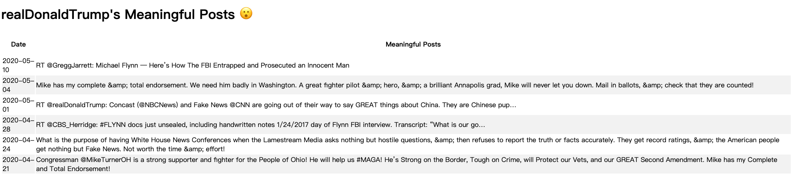

# Tweets-Summarizing-System

## Project Summary

- A system to show the most representative tweets of a certain user.
- Pull twitter data by using tweepy wrapper around the twitter API
- Give each tweet an importance score by implementing TF-IFG algoeithm.
- Processed the data by tokenizing with NLTK and stemming with PorterStemmer.

## A screenshot of how the system looks like:
